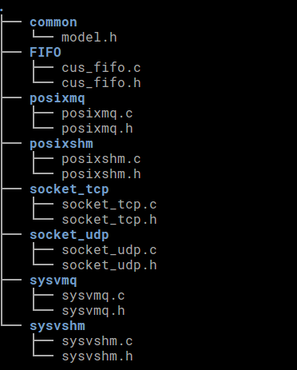
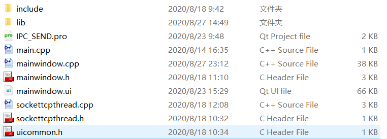
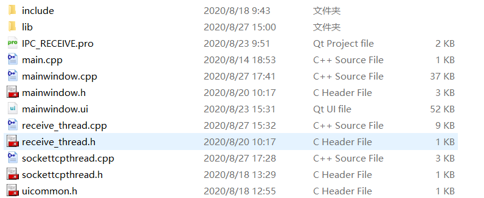
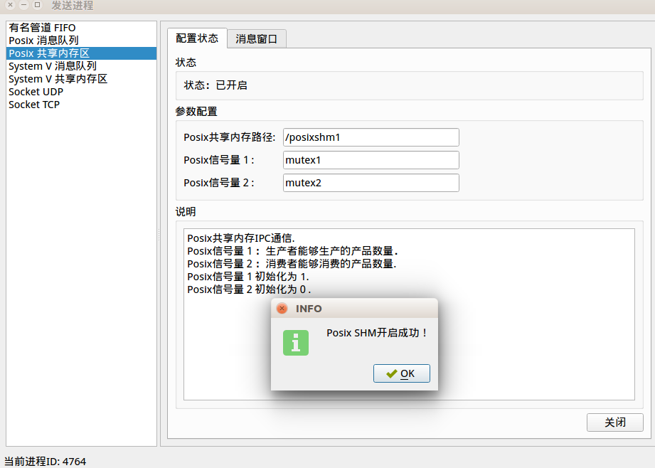
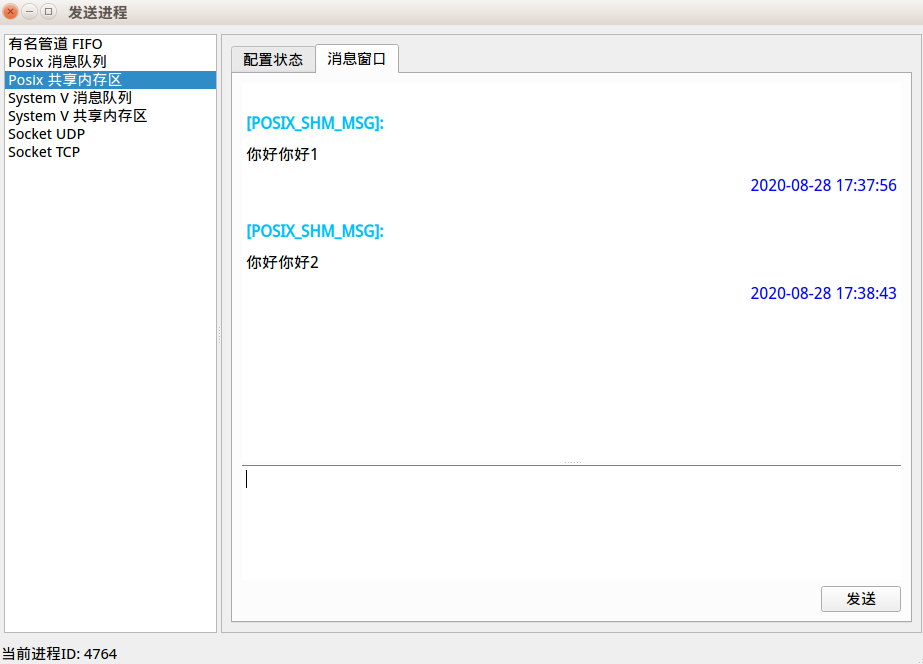
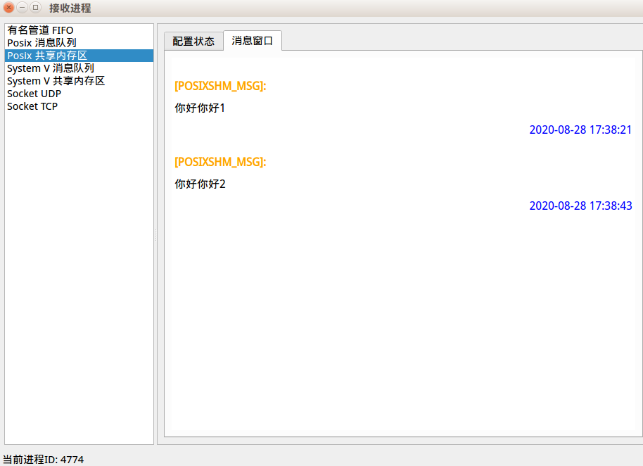
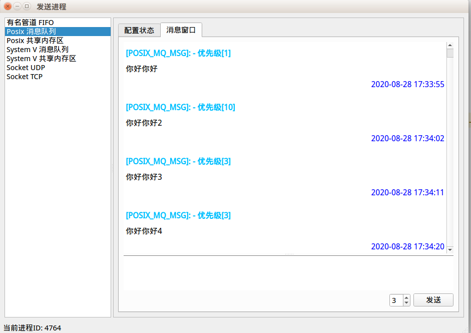

# 操作系统 - Linux平台的进程通信

+ 操作系统课设
+ 日期：2020年8月

## 任务和要求

基于Linux/Unix平台，实现进程间通信。

+ 编写两个进程，一进程负责发送字符串，另一进程负责接收字符串；
+ 分别支持 Unix/Liunx 的的共享存储区、消息队列、管道和 Socket；
+ 发送进程应可以从窗口或键盘上输入字符串；
+ 接收进程应可将字符串显示在窗口上；
+ 将核心代码封装成静态或动态链接库，核心代码必须由C语言编写
+ 演示程序利用个人编写生成的链接库进行演示，可以使用C++等语言

## 最终完成情况

​		库的设计，完全采用C语言编写，该库封装了7种进程间通信的方式，分别为：

- 有名管道（FIFO）

- Posix消息队列

- Posix共享内存

- System V 消息队列

- System V 共享内存

- Socket UDP通信

- Socket TCP通信

  由于以上7种IPC使用的方式相似，故为各种IPC设计了类似的API接口，最终使用CMake工具将相关代码编译成静态链接库。

​	演示程序的设计，采用C++语言编写，图形界面接口基于Qt5开发，并以静态链接库的方式链接。

## 项目目录说明

| 文件夹名    | 工程            | 说明                                                |
| ----------- | --------------- | --------------------------------------------------- |
| IPC_LIB     | LIB文件项目     | 基于cmake生成linux平台下的动态和静态链接库          |
| IPC_SEND    | IPC发送进程项目 | 基于Qt5开发，使用IPC_LIB的静态链接库演示IPC发送进程 |
| IPC_RECEIVE | IPC接收进程项目 | 基于Qt5开发，使用IPC_LIB的静态链接库演示IPC接收进程 |

三个目录分别代表三个工程。

### IPC_LIB

+ 执行环境

  + ubuntu 16.04 LTS
  + cmake version 3.5.1

+ 目录说明

  + build目录存放cmake编译后的文件
  + lib目录存放最终生成的库文件
  + src目录中为库的源代码

+ 执行命令
      在当前文件夹下执行命令: sh cmd.sh
  

  

### IPC_SEND

+ 执行环境

  + ubuntu 16.04 LTS
  + Qt Creator 4.11.1 Based on Qt 5.14.1

+ 目录说明

  + include文件夹存放库的头文件
  + lib文件夹存放静态链接库

  

### IPC_RECEIVE

+ 执行环境

  + ubuntu 16.04 LTS
  + Qt Creator 4.11.1 Based on Qt 5.14.1

+ 目录说明

  + include文件夹存放库的头文件
  + lib文件夹存放静态链接库

  

## 运行示例图片

